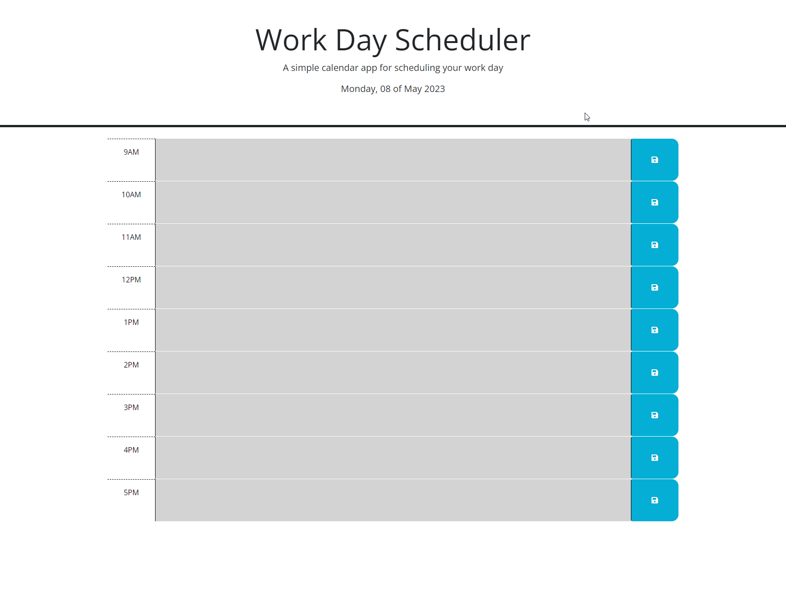

# Day Sheduler

## Description

The motivation behind this project was to use 3rd Party APIs in my script such as jQuery and Day.js to simplify the process in creating a day scheduler which records previous input via local storage and uses DayJS to decide if something is past, present or future which dynamically changes the classes. This allows the scheduler real world use as not only does it save data locally, it also is date dependent meaning that you are able to change the date and set reminders for future days; overall this allows you to organise your day better. 

I learned a lot about jQuery and API implementation. I have also learned how API implementation can help streamline processes and save you time as others have 'done the work for you' saving you from having to solve these problems yourself. 

## Screenshots

## Features

- Dynamically changes HTML classes based on time.

- Ability to change the date, allowing you to plan ahead and review previous days.

## Usage

To use the scheduler, head to [here](https://jackstockwell.github.io/scheduler/).

## Credits

[jQuery API documentation](https://api.jquery.com/) - jQuery API documentation used throughout my script.

[Day.js API](https://day.js.org/docs/en/display/format) - Day.js documentation.

[Bootstrap API](https://getbootstrap.com/docs/5.3/getting-started/introduction/) - Bootstrap API Documentation

[MDN on JavaScript](https://developer.mozilla.org/en-US/docs/Web/JavaScript) - Used to deepen my JavaScript knowledge.

## Future Development

- Modal to confirm the save of data.
- Alert to say that your data was saved.